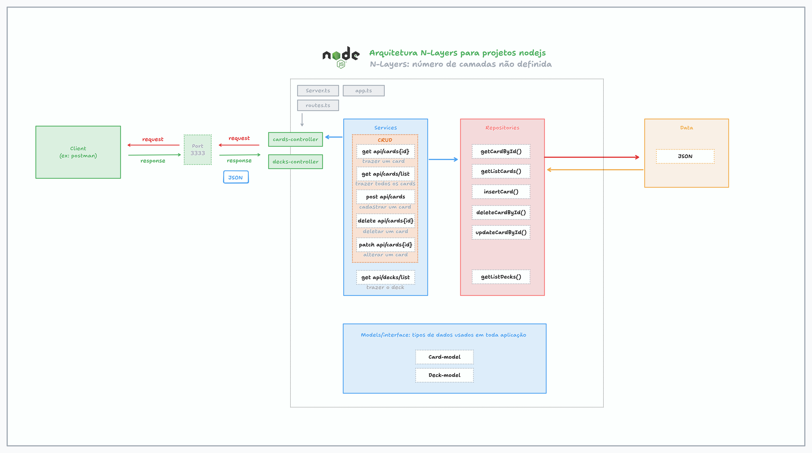

# 🧙‍♂️ MTG Deck API

Uma API RESTful que permite gerenciar decks e cartas do jogo Magic: The Gathering (MTG). Ideal para aplicações de gerenciamento de coleções, decks personalizados e estudos de cartas.

## Descrição

Objetivo: Fornecer uma API que permite listar, adicionar, editar e remover cartas e decks de Magic: The Gathering.

Esta API suporta:

Cadastro de cartas

Consulta individual ou geral de cartas

Atualização e remoção de cartas

Listagem de decks contendo cartas

## Tecnologias Utilizadas

Node.js

Express

TypeScript (se aplicável)

npm

Postman (para testes)

## Pré-requisitos

Node.js instalado (versão 16 ou superior)

### Clone o projeto

`https://github.com/Diandressa/MobileDeveloper-DIO.git`

Ir para o diretório: `cd API/API-NodeJs-Express/project-deck-magic`

### Install dependencies

`npm i`

### Run server

`npm run start:dev` or `npm run start:watch`

## API Endpoints 

http://localhost:3333/

GET /cards
Retorna todas as cartas cadastradas.

GET /cards/:id
Retorna os dados de uma carta específica pelo id.

POST /cards
Cadastra uma nova carta.

Exemplo de corpo (JSON):

{
  "name": "Serra Angel",
  "type": "Creature — Angel",
  "manaCost": "{3}{W}{W}",
  "text": "Flying, vigilance",
  "power": "4",
  "toughness": "4"
}

PATCH /cards/:id
Atualiza informações de uma carta existente.

Exemplo:

{
  "power": 0,
  "toughness": 0,
  "mana_cost": "{1}{R}"
}

DELETE /cards/:id
Remove uma carta pelo id.

### 🧙 Decks (/decks)

GET /decks
Retorna todos os decks com suas respectivas cartas.

## Variável do ambiente (.env)

PORT=3333

## Application architecture

## License

This project is licensed under the [MIT License](/LICENSE).

## Author

Name: Andressa Nicolau
LinkedIn: https://www.linkedin.com/in/andressa-nicolau

## Date

Completed: September 25, 2025

