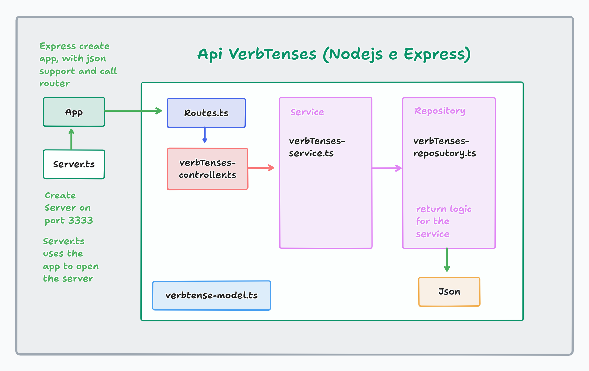

# API Verb Tenses

## Description

About: The API Verb Tenses return an example sentence and its verb tense. Also return sentence structure. You can delete, list and update data in this API (CRUD). 

Solve the problem: Help English learners understand and memorize sentence structure with examples.

Technologies used: 


## Installation

Requirements: Node.js

### Clone this project

`https://github.com/Diandressa/MobileDeveloper-DIO.git`

Go to directory, in terminal: `cd API/API-NodeJs-Express/project-verb-tenses`

### Install dependencies

`npm i`

### Run server

`npm run start:dev` or `npm run start:watch`

## API Endpoints 

GET /api/verbtenses

GET /api/verbtenses/:tense

> tense: simple-present | present-continuous | present-perfect | present-perfect-continuous | simple past | past-continuous | past-perfect | past-perfect-continuous | simple-future | future-continuous | future-perfect | future-perfect-continuous

POST /api/verbtenses

Request body Example:
```
{
    "id": 11,
    "code": "future-perfect",
    "name": "Future Perfect",
    "formula": "Subject + will + have + past participle",
    "examples": [
    "I will have finished the book by tomorrow.",
    "She will have graduated by next year."
    ]
}
```
PATCH /api/verbtenses/:tense/:id

DELETE /api/verbtenses/:id

## Environment variables (.env)

PORT=3333

## Application architecture



## License

This project is licensed under the [MIT License](/LICENSE).


## Author

Name: Andressa Nicolau
LinkedIn: https://www.linkedin.com/in/andressa-nicolau

## Date

Completed: September 9, 2025
