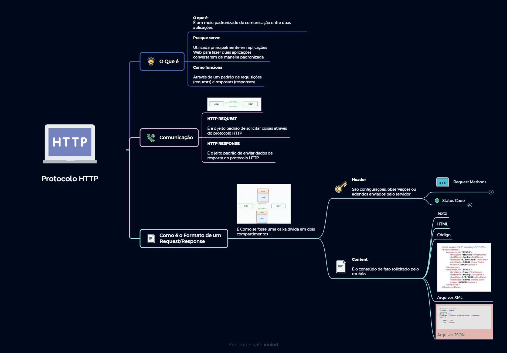
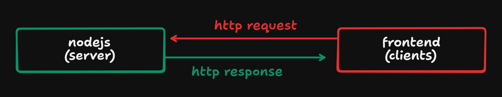
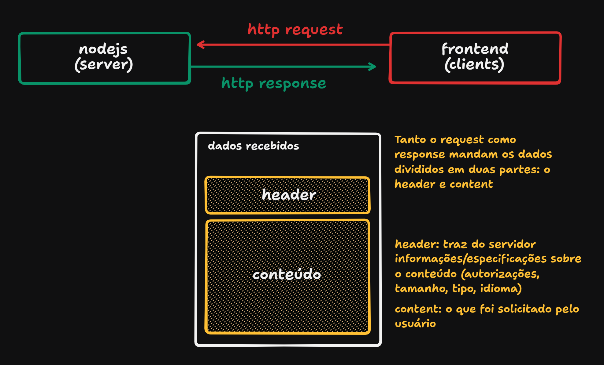
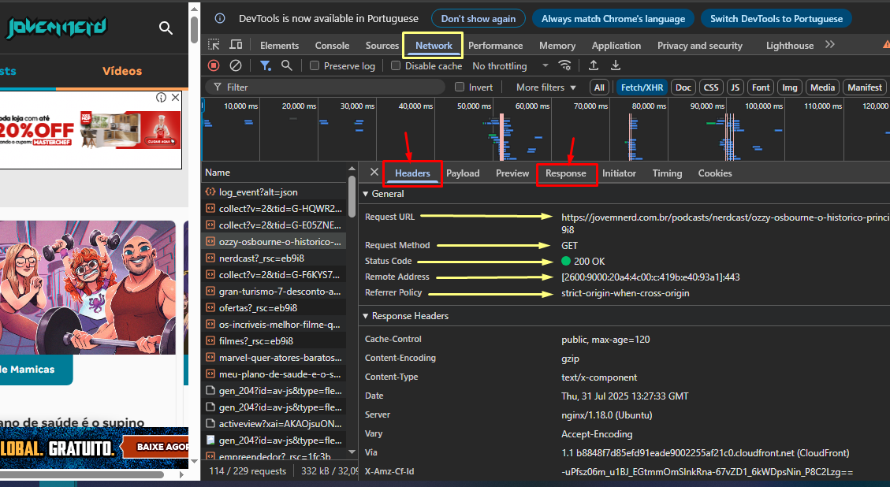
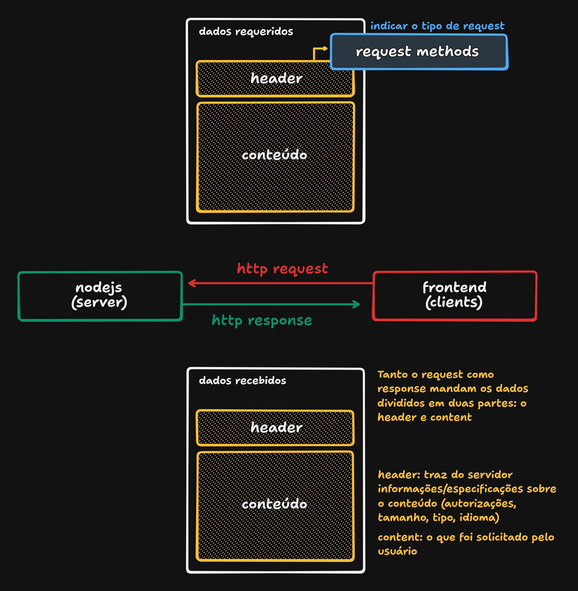
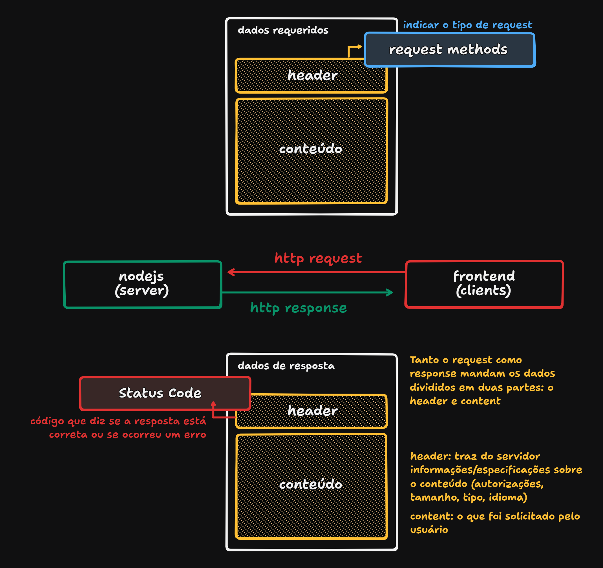

# Como funciona HTTP Protocol

O que é?
Protocolo HTTP(HyperText Transfer Protocol) é maneira/meio do server e o client (duas aplicações) se comunicarem de forma padronizada, no qual as duas conseguem se entender na troca de informação.

Pra que serve?
Utilizada em aplicações web para duas aplicações conversem de maneira padronizada.

Como funciona?
Através de um padrão de requisições (request) e respostas (responses).

## Mapa mental

## Request & Response

Comunicação:

HTTP REQUEST

É o jeito padrão de solicitar coisas através do protocolo HTTP

HTTP RESPONSE

É o jeito padrão de enviar dados de resposta do protocolo HTTP

HTTPS - É o http com uma camada a mais de segurança

## Header & Content

Podemos ver no dev tools, em Network (seleciona filtro com Fetch/XHR), o header e a response

## Request Methods

É essencial mandar no header: request methods (verbos http) e o status code.

Request Methods:

Diz o tipo da requisição, sempre é especificado no header.

* GET: quando quero solicitar um dado do servidor para o front-end;
* POST: quando quero enviar algum dado para o servidor guardar ou fazer um processamento (no banco ou no servidor);
* PUT: quando quero que o servidor atualize todos os registros/dados (por completo), do banco ou do servidor mesmo;
* PATCH: quando quero que o servidor atualize algum registro parcialmente (um específico), do banco ou do servidor mesmo;
* DELETE: quando quero que o servidor delete algum registro do banco ou do próprio servidor (como dados temporários no servidor).

## Status Code

Status Code precisa vir em uma resposta no header.

Existem vários status que a aplicação pode retornar

* 1XX - Informativos
* 2XX - Sucesso
* 3XX - Redirecionamento
* 4XX - Erro do lado do cliente (frontend)
* 5XX - Erro do lado do servidor (backend)

## Principais Status Code

* 1XX - Informativos: **100 continue / 102 processing**

* 2XX - Sucesso: **200 OK / 201 Created / 203 Not-Authoritative Information / 204 No-Content**

* 3XX - Redirecionamento: **302 Found / 305 Use Proxy**

* 4XX - Erro do lado do cliente (frontend): **400 Bad Request (formato não esperado) / 401 Unauthorized / 403 - Forbidden (proibido) / 404 Not Found**

* 5XX - Erro do lado do servidor (backend): **500 Internal Server Error / 501 Not implemented / 502 Bad Gateway / 503 Service Unavailable (serviço caiu) / 507 Insufficient Storage (banco de dados atingiu o limite** 

## Content

O Content pode retornar: Texto, HTML, Código, Arquivos XML (pouco usado/antigo), Arquivos JSON.

## Extras

Site para fazer mapa mental: https://xmind.com/

