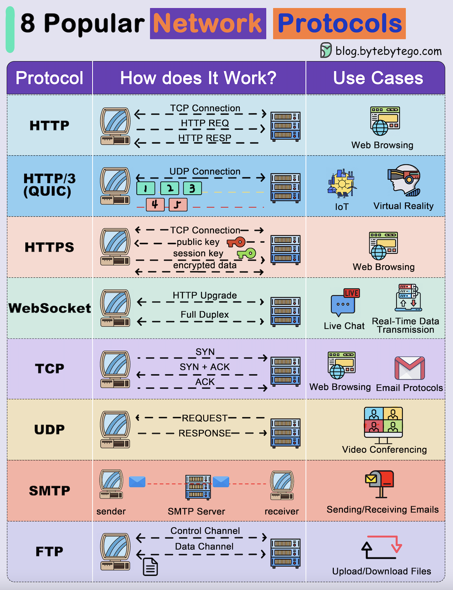

# Introdução ao desenvolvimento de API

## Sentido Semântico

API (Application Programming Interface) 📃➡ Interface de Programação de Aplicativos

Sentido:

Programação de Aplicativos = Criar uma solução que sirva e atenda a problemas de negócio
Interface (na programação) = Contrato/Regras padrão 

API = Aplicação que foi programada para servir dados para um negócio, seguindo padronização de um tipo de contrato de programação, esse contrato é o protocolo HTTP. 

API = Aplicação para servir dados de maneira padronizada seguindo algum protocolo de comunicação.

Tipos de protocolos:

## O que é?

O que é?

É um tipo de aplicação backend para servir dados e serviços de maneira padronizada

Pra que serve?

Receber e processar dados em serviços e responder para outras aplicações (sejam outros backends ou frontends)

Como funciona?

É uma aplicação programada utilizando algum padrão de protocolo para servir dados

## Características de uma API

* Ter um protocolo de comunicação rígido, tanto para **responder(response)** coisas, quanto para **requisições(request)**. Protocolo adotado: HTTP
* Sempre serve algum conteúdo (content) seguindo os padrões do protocolo adotado
* Padrões de Arquitetura: REST é muito usado

## REST

REST (Representational State Transfer) 📃➡ Transferência de Estado Representacional

State = Estado, algo/conteúdo guardado em um lugar, naquele momento (variável, objeto, arquivo). 

Representational State = Representa/apresenta o estado no meu backend/frontend no momento

Transfer = Transferência 

Resumindo...

API REST = Uma aplicação baseada em contratos que transfere seu conteúdo (naquele momento) para outro lugar (frontend). Transferir o conteúdo do backend para o frontend através de um protocolo, no caso iremos usar o protocolo HTTP.

## RESTful Caracteristics

Para minha aplicação estar no padrão REST:

* Ter Arquitetura Cliente x Servidor (ter o servidor e o frontend separados);
* Comunicação stateless = Comunicação sem estado, o servidor não armazena as requisições e seus estados;
* Cache = Ter a possibilidade de pegar as requisições já utilizadas anteriormente e mandar essa mesma informação (sem precisar processar novamente);
* Interface uniforme = interface é contrato, então preciso seguir o contrato. Padronizo uma resposta de entrega, fiel ao tipo de formato (se estou trabalhando com json, então sempre vou usar o json como resposta). Respeitar o formato de entrega, ter coerência na aplicação.
* Sistema de camadas = Pastas seguem os mesmo padrões, respeitando as camadas. Dentro da pasta services sempre tera arquivos de serviços, por exemplo. Organiza os arquivos nas pastas corretamente.

REST: Posso implementar algumas delas, mas não preciso respeitar todas ao mesmo tempo. 

RESTfull: Chamamos de **RESTful** quando respeitamos todas as cinco.

REST**ful** = full = aplicação completa REST

## REST x RESTful

Nem toda aplicação precisa ser RESTful, depende do tipo e uso dessa aplicação.

## Anotações

Quando ver Interfaces em documentação, significa as regras e padrões que preciso obedecer para poder utilizar

Servidor é um aplicação que serve outra

