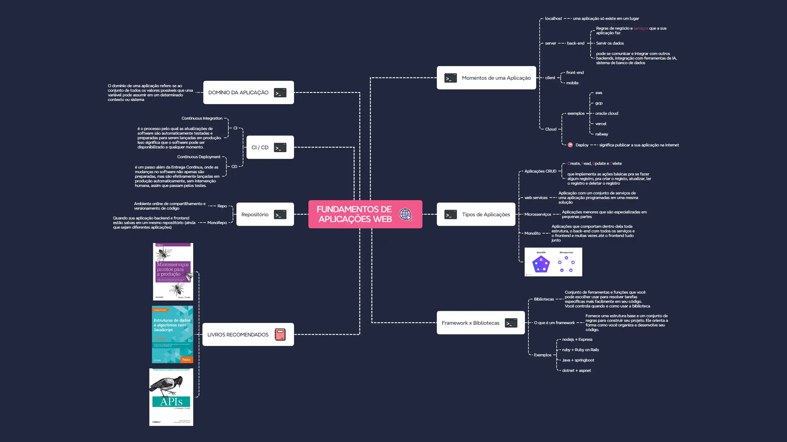
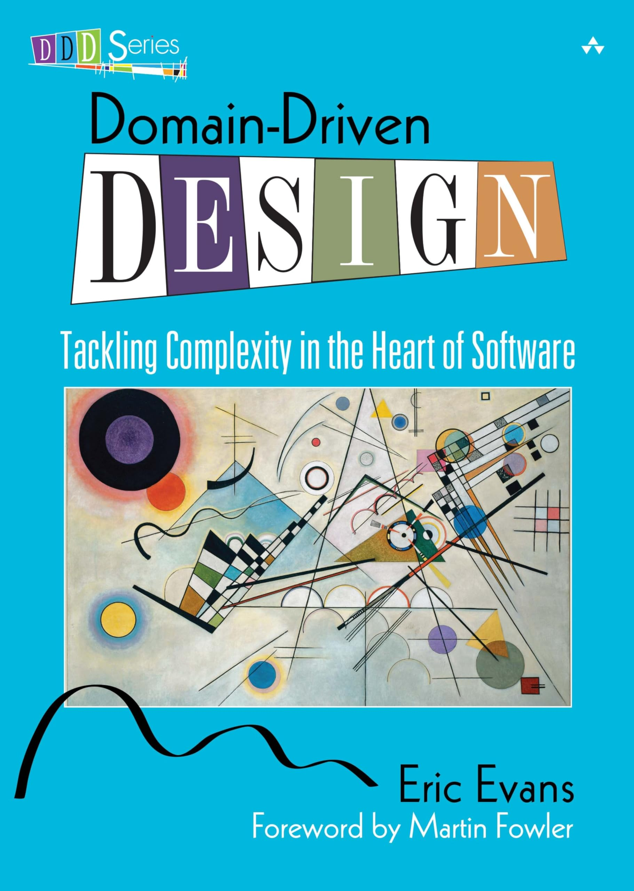
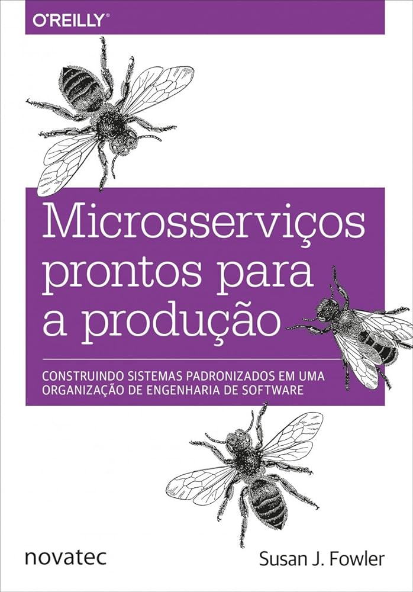

# Introdução a Aplicações Web

## Dicionário da Web / ABC Dev

## Microsserviços x Monolitos

Web Services:

Um web serviço é um serviço oferecido por um servidor (via rede/HTTP).

O cliente faz uma requisição ao servidor, O servidor responde com a informação ou realiza a ação pedida.

Monolito (ou Arquitetura Monolítica):

Um sistema único, onde tudo está junto no mesmo projeto/aplicação (front-end, back-end, lógica de negócio, banco de dados).

Microsserviços (ou Arquitetura de Microsserviços):

Um sistema dividido em vários serviços pequenos e independentes, cada um responsável por uma parte da aplicação (ex: serviço de login, serviço de pagamento, etc).

## CI / CD

Continuous Integration (CI): É o processo no qual todo novo código adicionado ao projeto é automaticamente testado, integrado com o restante da aplicação e validado.

Continuous Deployment (CD): CD é o processo de deploy automático da aplicação após o CI.

O processo padrão é algo assim:

1. Build/CI — Você faz o build do projeto e executa testes.

2. Instalar Dependências — Baixa os pacotes (ex: npm install, pip install ou outro gerenciador de pacotes).

3. Deploy/CD — Depois do build e testes OK, você faz o deploy para o ambiente de produção.

## Domínio da Aplicação

Domínio da Aplicação

É o tema central ou contexto de negócio que a aplicação busca resolver.

Exemplos:

1. **Sistema bancário**  
   Domínio: contas, transações, empréstimos, clientes

2. **Aplicativo de saúde**  
   Domínio: pacientes, consultas, exames, médicos

3. **Loja virtual (e-commerce)**  
   Domínio: produtos, pedidos, carrinho, pagamentos, estoque

4. **Rede social**  
   Domínio: usuários, postagens, comentários, amizades

5. **Aplicativo de transporte (tipo Uber)**  
   Domínio: motoristas, passageiros, corridas, pagamentos

6. **Aplicativo de transporte (tipo Uber)**  
  Domínio: motoristas, passageiros, corridas, pagamentos

## Indicação de livro

### Domain-Drive Design (DDD) - Eric Evans : Mostra maneiras de transformar um modelo de negócios em software, modelar a aplicação através de um domínio (Uma metodologia de desenvolvimento).

Link para leitura: https://github.com/KAYOKG/BibliotecaDev/blob/main/LivrosDev/Domain-Driven%20Design%20Referência%20-%20Sumário%20de%20Padrões%20e%20Definições%20-%20Autor%20(Eric%20Evans).pdf

### Estruturas de dados e algoritmos com JavaScript - Loiane Groner

Link do pdf: https://www.kufunda.net/publicdocs/Estruturas%20de%20dados%20e%20algoritmos%20com%20JavaScript%20(Loiane%20Groner).pdf  

### Microsserviços prontos para a produção

Link para leitura: https://github.com/ludmilaalvespinto/livros/blob/main/Microsserviços%20prontos%20para%20a%20produção%20(Susan%20J.%20Fowler%2C%20traduzido%20por%20Claudio%20Adas)%20(z-lib.org).pdf
