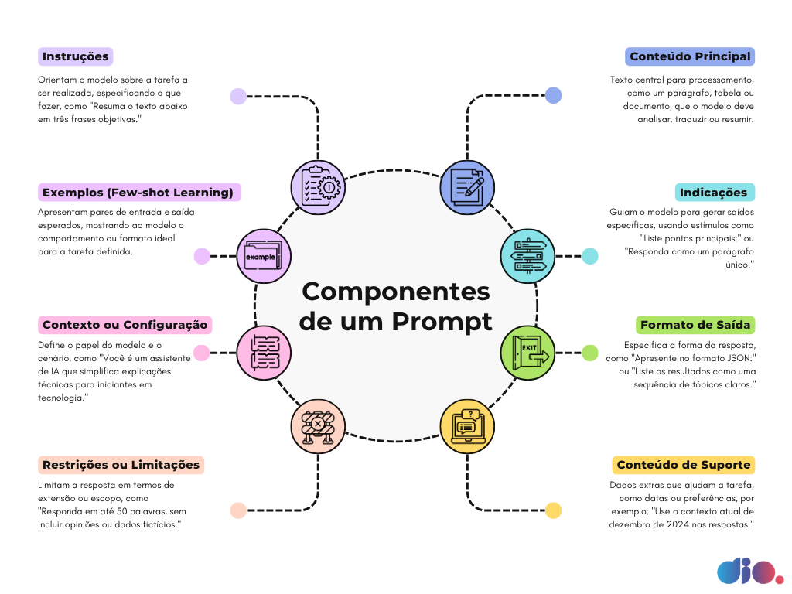

# Desenvolvimento IA Powered

## Introdução à Engenharia de Prompts

Ordem para escrever um prompt

1 - Instrução Inicial

2 - Contexto Adequado (mais características/informações)

3 - Exemplos/Referências

4 - Dados de Entrada - Problemas a ser solucionado, dados personalizados para o modelo 

5 - Formato de Saída - Qual formato quero essa resposta.

## Técnicas de engenharia de Prompts

## Apresentação com os slides do curso

https://www.canva.com/design/DAGYbpmAiQA/NH0YSZ6tAbdBjNgKJsnFIw/edit

# Github Copilot

`Control+i` ou clica no ícone

// comando usando comentário

Podemos utilizar pelo CLI/Terminal:

Instale o GitHub CLI no terminal CMD como Administrador:

`choco install gh` 

Para autenticar:

`gh auth login` e logar

A extensão do github copilot já vem instalada por padrão.

Ver mais: https://github.com/github/gh-copilot 
 
ou https://cli.github.com/ -> baixar o instalador

Teste a versão:

`gh --version`

Comando: 

`gh copilot explain "git init"` ou `copilot -i "explain git init"`

Caso peça para instalar o Github Copilot CLI, aceite

Veja sobre o github copilot: https://github.com/features/copilot?locale=pt-BR 
