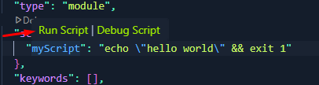
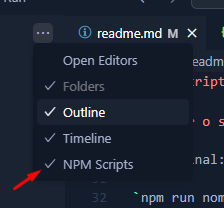
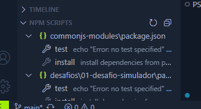
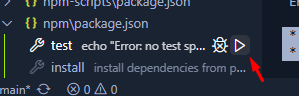

# Npm Scripts

Com scripts consigo rodar mais de um comando uma única vez

## Script Field

No package.json:

```
"scripts": {
"test": "echo \"Error: no test specified\" && exit 1"
},
```

script field:

"scripts": {},

script test:

test é o alias no script, o apelido 

Quando passo o próximo comando uso  &&:

1 comando: "echo \"Error: no test specified\" 
2 comando: exit 1

Comando entre aspas: "iniciar": "node src/index.js",

## Rodar o script

No terminal:

`npm run nome-script`

Exemplo:

`npm run test`

## Vscode View npm scripts

Podemos rodar o script pelo package.json:



Ir no vscode, ao lado de Explores > ... > ativar o npm script



Isso ativa a barra inferior de NPM SCRIPTS 



Dar play para rodar o script



## Create script

Criar no script field os script:

```
"scripts": {
    "myScript": "echo \"hello world\" && exit 1",
    "iniciar": "node src/index.js"
},
```

## Script Multi Tasks

Uso o && (e comercial):

"iniciar": "node src/index.js && mkdir dist && echo\" pasta dist criada\" "

> o \" conteúdo \" o caractere de escape para usar as aspas dentro do comando que já tem aspas.
Imprimir "pasta dist criada" -> com aspas no terminal

## Scripts Naming

Scripts mais comuns em projetos:

"scripts": {
    "prebuild": "npm install",
    "start:dev": "node src/index.js",
    "start:watch": "node --watch src/index.js" 
  },

  > prebuild são os comandos que devem ser rodados primeiro

## Script Naming Guidelines

Principais scripts:

[principais scrips naming](semmantic-script-names.md)
ou
[repositório: digitalinnovationone-formacao-nodejs](https://github.com/digitalinnovationone/formacao-nodejs/blob/main/08-npm-scripts/docs/semmantic-script-names.md)

Convenções: 

Cada empresa pode adotar o seu.

* padronizar em minúsculos
dev: Start the development server with hot reloading.
build: Build the application for production.

* separar por contexto, usar nome:especificidade

test: Run unit tests.
test:watch: Run unit tests in watch mode.
test:coverage: Generate test coverage report.

Exemplo do react: https://github.com/facebook/react/blob/main/package.json 


