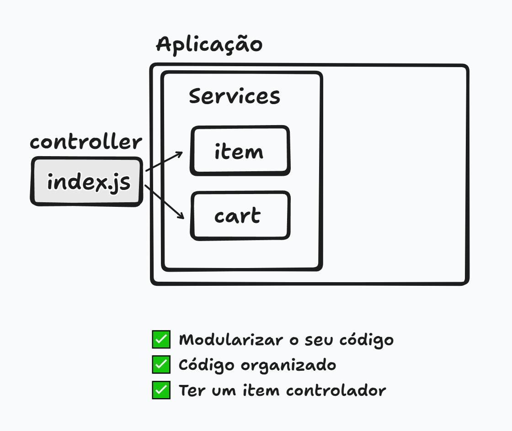

# Bootcamp de NodeJS 

Bootcamp de NodeJS da DIO
Node é uma plataforma pra rodar JavaScript

## Projetos

### 🚗 [Simulador de Corridas - Mario Kart](desafio-simulador/readme.md)
### 🛒 [Carrinho de Compras da Shopee com Node.js](carrinho-compras/readme.md)

## Iniciar projeto/ criar package.json

Sempre ao criar um projeto dar o npm init para criar o package.json:

`npm init`
`npm init -y` - sim automaticamente para as perguntas iniciais de criação

cria o package.json

## cria pasta src

Colocar os arquivos que irei codificar nesta página,
e fora dele os arquivos de configuração do projeto, como o package.json

## rodar projeto

node e o caminho do arquivo:\
`node src/index.js`

## rodar o projeto com node a cada alteração com watch

`node --watch src/index.js`

## comandos terminal

* del * (deleta todos os arquivo)
* del src/index.js (deleta o arquivo)
* ls (lista todos os arquivos)
* cls (limpa o terminal)
* cd .. (volta para pasta anterior)
* cd (entra na pasta)
* mkdir src/nomepasta (cria uma pasta)
* code src (abre a pasta no vscode)
* code . (abre o vscode em nova aba)

## comandos terminal Node

* npm init (cria package.json do projeto)
* npm init -y (inicia com sim)
* node src/arquivo.js (roda arquivo)
* node --watch src/arquivo.js (roda arquivo a cada alteração)

## Anotações

alt + shift + 🔽 = copiar a linha para a linha de baixo

roda a cada mudança no index.js:

`node --watch src/index.js `

## Arquitetura da solução

Controller chama as funções

### async

Uma async function em Node.js é uma função assíncrona que permite a execução de operações assíncronas dentro dela. Ela retorna uma Promise, o que permite o uso de await para aguardar a resolução de outras Promises dentro da função.