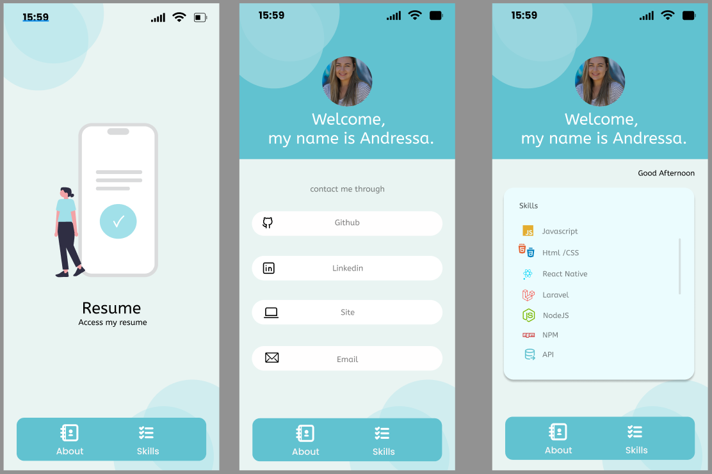

# Curriculum

## Layout



## BottomTabBar Style


## SafeAreaView

O SafeAreaView é um componente que impede que o conteúdo da sua tela fique escondido atrás de partes do sistema do celular, como:

* A notch (aquele recorte na parte superior do iPhone)
* A barra de status (onde ficam hora, bateria, etc.)
* A barra de navegação inferior (com os botões do Android)
* As bordas curvas de telas modernas

Ou seja, ele respeita as “áreas seguras” do dispositivo.

🛠️ Como ele funciona

Sem o SafeAreaView, seu conteúdo ocupa toda a tela (flex: 1), podendo ser coberto por partes do sistema.

Com o SafeAreaView, o React Native detecta automaticamente as margens seguras do aparelho e adiciona padding nessas áreas — assim, nada fica escondido.

```
<NavigationContainer>
    <SafeAreaView style={{ flex: 1, backgroundColor: '#fff' }}>
        <BottomTabsRoutes/>
    </SafeAreaView>
</NavigationContainer>
```

