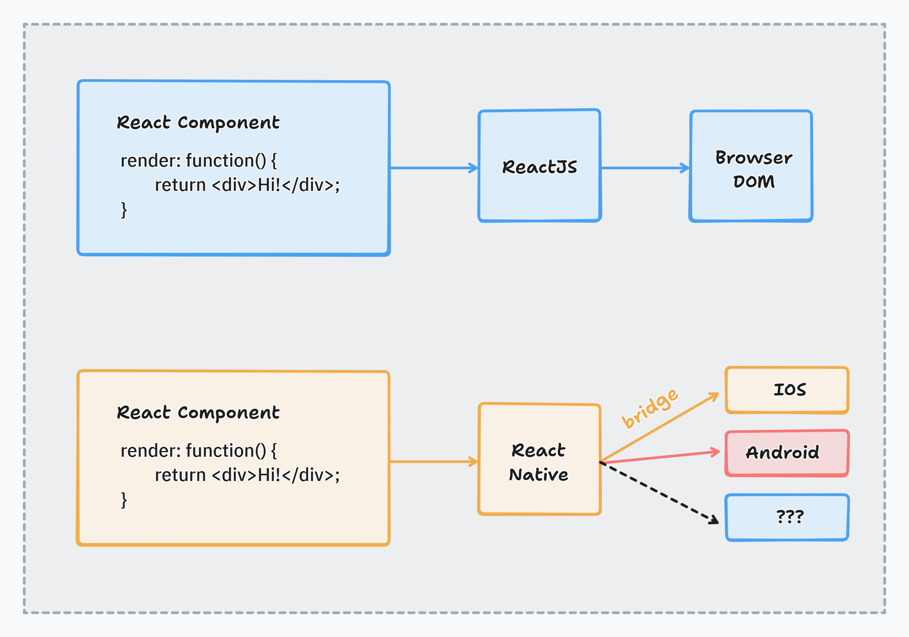
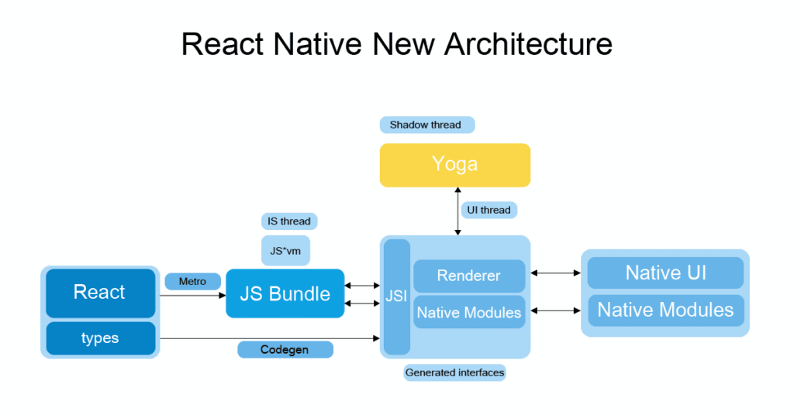
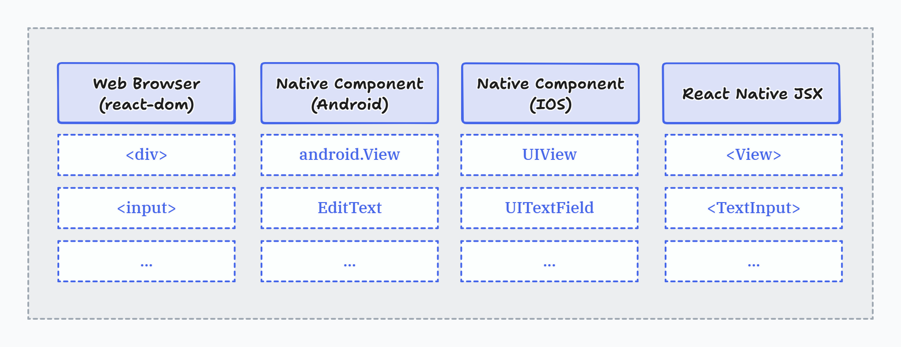

# React Native

## Introdução ao React Native

### O que são nativos e híbridos

Linguagens que são nativas para desenvolver com Android: Kotlin ou Java

Linguagens que são nativas para desenvolver com IOS: Objective-C ou Swift

As linguagens híbridas ferramentas que posso desenvolver independente da plataforma: React Native, Flutter, Xamarin, Ionic, Framework7

Permite o dev se identificar melhor utilizando a ferramenta que ele já trabalha para web.

### Nativos

Vantagens: 

* As novidades chegam primeiro na linguagem nativa (a linguagem fica pronta para lidar com aquilo)
* 100% de aproveitamento do processamento, melhor performance

Quando utilizar o nativo?

Quando o app requer um recurso especifico daquele hardware (Android ou IOS) ou quando preciso de um nível de performance/processamento muito alto.

Desvantagens:

* As linguagens nativas são feitas para aquele ambiente especifico, é necessário fazer dois apps em paralelo, um para o Android e outro para o IOS (com pessoas especialista naquelas linguagens)
* Não tem tantas pessoas desenvolvedoras do swift(IOS), dependo do hardware (Mac)

### Híbridos

Tecnologias cruzadas no ambiente mobile, um desenvolvimento que gera dois apps (Android e IOS)

Desvantagens: 

* Quando chega novidades no Android ou IOS, preciso aguardar sair o pacote/versão para uso nos Híbridos
* Tem mais camadas de conversão para ser executado. (Não tem uma queda de performance tão grande)
* Cada híbrido tem estratégias diferentes para o mobile, cada um funciona diferente do outro.

Vantagens:

* Mais econômico para as empresas.
* Multi-plataforma: Uma pessoa desenvolve tanto para Android quanto para IOS usando somente o híbrido.

Quando utilizar?

Quando não dependo do tanto de novos recursos do hardware.

### React vs React Native



### Arquitetura React Native



### React Native Component 



Cada component utilizado precisa ser importado

```
import { StyleSheet, Text, View } from 'react-native';
import { StatusBar } from 'expo-status-bar';

export default function App() {
  return (
    <View style={styles.container}>
      <Text>Open up App.tsx to start working on your app</Text>
      <StatusBar style="auto" />
    </View>
  );
}
```

O componente quando chega no Android é convertido para linguagem do Android e quando chega no IOS é convertido para IOS.

Os componentes são funções javascript que retornam tags

Conteúdos soltos, sem estar dentro do component o Android não entende, dá erro:

```
<View style={styles.container}>
    <Text>Hello Andressa</Text>
    texto puro
</View>
```

A <View> equivale a <div>

Os componentes devem começar com letra maiúscula.

Igual o React, tudo precisa estar dentro de uma <View>, não posso retornar dois componentes na função

## Component Expo

Além dos componentes que o React Native fornece, também temos os componentes do próprio Expo

## Style Inline

O style é declarado como se fosse uma função javascript, por isso uso chaves. Usado para coisas mais específicos

No inline declaro o objeto dentro da função { {} } , já em linha:

`<Text style={{ color: 'red'}}>Nicolau</Text>`

```
<Text 
    style={{
        color: 'blue', 
        backgroundColor: 'red',
        fontSize: 30
    }}>
Hello Andressa
</Text>
```

## Stylesheet

Não tem css no React Native, é tudo objeto. Usado quando quero reaproveitar o estilo em outros componentes e estilo com muitas propriedades.

Ao importar o StyleSheet consigo usar as estilizações com folha de estilo. 

Criar como se fosse uma classe css, cria uma const com o objeto, o nome do objeto é como se fosse o nome da classe:

```
const styles2 = StyleSheet.create({
  titleStyle: {
    fontSize:35
  }
})
```

No App():

`<Text style={styles2.titleStyle}>Aula React Native</Text>`

## Comentários

```
<View style={styles.container}>
  {/* Comentário em React Native */}
</View>
```

## Trabalhando com Imagens

Importar o component Image e a imagem.

```
import { Image, StyleSheet, Text, View} from 'react-native';
import symbolOn from './assets/pictures/symbol-on.png'
```

Utilizar o valor

```
<View style={styles.container}>
  <Image source={symbolOn}></Image>
</View>
```

Dá erro: Fala que o tipo não corresponde a declaração. Estamos trabalhando com typescript, png o React Native não entende como tipo. PAra o React NAtive entender o png:

Dentro da raiz do projeto criamos o arquivo: `declarations.d.ts` (o nome precisa ser esse).

Dentro desse arquivo, declaramos o tipo/módulo png:

`declare module '*.png'`


Imagem pelo link direto, com duas chaves {{}}, preciso definir o tamanho da imagem se não ele não aparece:

```
<Image
  source={{
    uri: 'https://reactnative.dev/img/tiny_logo.png',
  }}
  style={{ width: 100, height: 100 }}
/>
```

## If ternário no component style

Adicionando lógica em um component

`<Image source={isActive ? symbolOn : symbolOff}/>`

## Estilo condicional

`<View style={isActive ? styles.containerOn : styles.containerOff}>`

```
const styles = StyleSheet.create({
  containerOn: {
    flex: 1,
    backgroundColor: 'black',
    alignItems: 'center',
    justifyContent: 'center',
  },
  containerOff:{
    flex: 1,
    backgroundColor: 'gray',
    alignItems: 'center',
    justifyContent: 'center',
  }
});
```

## Criando áreas sensíveis ao toque

Componentes de touch: https://reactnative.dev/docs/touchableopacity 

Tudo que estiver dentro do component <TouchableOpacity> é sensível ao toque.

`<TouchableOpacity onPress={()=>{console.log('hello')}}>`

ou chamar uma função:

```
 function handleSymbol(){
    console.log(isActive) // true
    //inverte o valor
    isActive = !isActive
    console.log(isActive) //false
  }
```

`<TouchableOpacity onPress={handleSymbol}>`

Altera o valor, mas não renderiza.

## Controle de estados

Conceitos importantes:

Estado do componente: O estado é o que controla o comportamento e o conteúdo dinâmico de um componente. Quando o estado muda, o componente é re-renderizado automaticamente para refletir essa mudança.

Metro Bundler: transpila seu código. Transforma código moderno (ES6+, JSX, TypeScript) em código que o JavaScript engine do celular entende — normalmente com Babel.

Renderizar: O React "interpreta" isso e renderiza (desenha) esse conteúdo na tela do celular, usando elementos nativos do Android/iOS.

O React Native usa o Metro Bundler para empacotar e enviar o código para o app no celular, apenas quando há mudança no código-fonte.

Quando você altera o estado de um componente usando useState, o React Native re-renderiza automaticamente os componentes afetados, sem precisar reenviar o código via Metro.

Portanto, você não precisa "renderizar com o Metro" toda vez que uma função for chamada — isso é feito automaticamente pelo mecanismo do React.

╔══════════════════════╗
║ 🖥️ SEU CÓDIGO-FONTE  ║
║ (JSX, JS, TS, etc.)  ║
╚══════════════════════╝
          │
          ▼
╔══════════════════════╗
║ 🚆 METRO BUNDLER     ║
║ (empacota e envia)   ║
╚══════════════════════╝
          │
          ▼
╔══════════════════════╗
║ 📱 APP NO CELULAR    ║
║ Código carregado ✔️  ║
╚══════════════════════╝

-------------------------- MUDANÇA DE FLUXO --------------------------

🔁 O que acontece ao interagir com o app:

🧠 Código já está no app → React cuida da lógica

╔══════════════════════╗
║ 📲 USUÁRIO INTERAGE  ║
║ (ex: botão clicado)  ║
╚══════════════════════╝
          │
          ▼
╔══════════════════════╗
║ ⚛️ setState (useState)║
║ Estado do componente ║
║ é atualizado         ║
╚══════════════════════╝
          │
          ▼
╔══════════════════════╗
║ 🔁 RE-RENDERIZAÇÃO    ║
║ React redesenha só   ║
║ os componentes afet. ║
╚══════════════════════╝

✅ Nenhum novo código é enviado pelo Metro!

## UseState

O código faz a ponte para o aplicação uma única vez. Preciso alterar o JS de fundo rodando na aplicação.

Vamos usar um hooks (gancho). O hook está ligando o código com a aplicação.

Tipos de hooks: https://pt-br.legacy.reactjs.org/docs/hooks-overview.html 

Ele é do react, precisamos importar a biblioteca react, também importamos o useState:

`import React, {useState} from 'react';`

Usando o useState:

const [isActive, setIsActive] = useState(false)`

Passamos a variável, a função que vai alterar a variável = useState com valor inicial entre parênteses.

Chama o set na função para alterar o valor:

```
function handleSymbol(){
  setIsActive()
}
```

Recupera o valor inicial no parâmetro do setIsActivate:

```
function handleSymbol(){
  setIsActive((oldValue:boolean) => {
    return !oldValue
  })
}
```


