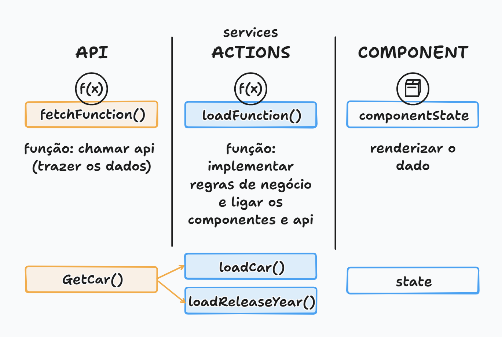
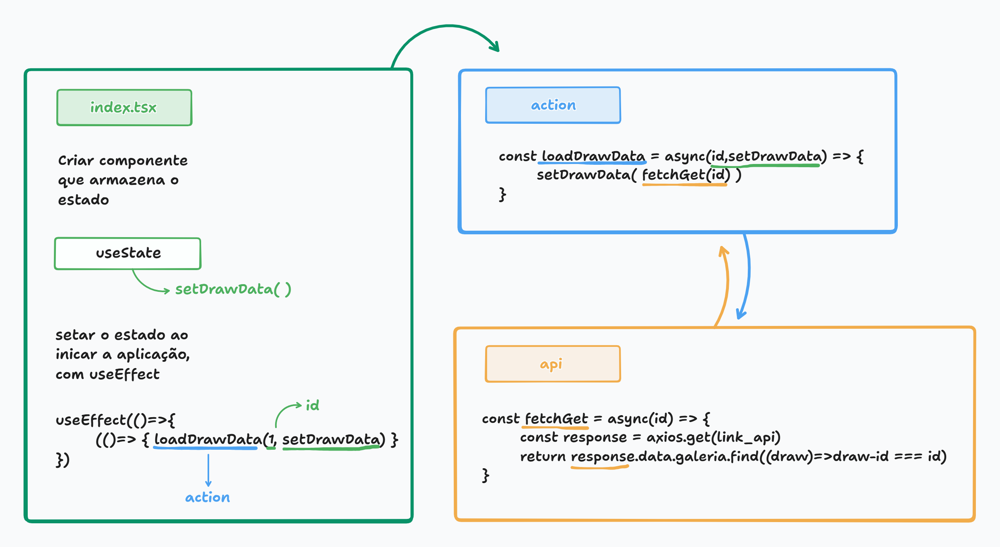

# Actions API

Precisamos usar um arquivo intermediário para conversar com a API e o component (mais prático a manutenção assim), os actions:



# Processo consumir API com axios



# Instalar Axios

Preciso usar o axios(dependência) para consumir API: https://axios-http.com/ptbr/docs/intro

1 - Comando no terminal:\
`npm install axios`

importa ele:

`import axios from "axios";`

2 - Cria arquivo action.ts e o modelo em props.tsx na pasta do componente

Em props.tsx cria o modelo\
```
export interface dataModel{
    id:number;
    titulo: string;
    descricao: string;
    cores_predominantes: string[];
    link: string;
}
```

Em actions.ts cria a lógica que chama a api:\
```
import { fetchGetData } from "../../api/getData"
import { dataModel } from "./props"

export const loadData = async() => {

}
```
3- Cria pasta constants em src, e o arquivo .ts com a url da api

`export const DRAW_API_BASE = "https://";`

4 - Cria pasta api dentro de src

Importa axios, o modelo, e a constante

```
import axios from "axios";
import { dataModel } from "../components/CardView/props";
import { DRAW_API_BASE } from "../constants/draw";
```

5 - Cria modelo para receber tipo array com os dados recuperados

```
interface ApiResponse {
    array: dataModel[]
}
```

6 - Cria a função fetchGetData com try e catch

```
export const fetchGetDrawData = async(id:number) => {
    try{
        //traz toda a lista da api
        const response = await axios.get<ApiResponse>(DRAW_API_BASE)

        //pega os dados de um objeto só, com id específico
        const drawData = response.data.galeria_design4users.find((draw) => draw.id === id)
        return drawData;

    } catch(error){
        console.log("Erro ao buscar dados da api fetchGetData", error);
    }
}
```

7 - Precisamos criar o estado que recebe essa API

Na index, no /components importa o use state e cria a constante que vai receber a api:

`const [data, setData] = useState<DataModel | null>(null);`

Chama função da action e seta um estado/valor assim que a tela iniciar, usando o useEffect:

```
useEffect(()=>{
    (async()=>{
        await loadData(2, setData);
    })();
}, []);
```

() -> no final do async, significa que a função é auto invocável (executa assim que é lida)

Passa a função do action que carrega os dados, com id a o set como parâmetros: 


8 - No actions.ts:

```
import { fetchGetData } from "../../api/getDraws"
import { DataModel } from "./props"

export const loadData = async(id:number, setDrawData:React.Dispatch<React.SetStateAction<DataModel | null>>) => {
    //solicita para API
    const response = await fetchGetData(id)

    try{
        if(response){
            setData(response)
        }
    }catch(error){
        console.log("Error ao buscar a api", error)
        setData(null)
    }
}
```

# Navegação

```
export const handlePreviousItem = async(data: DataModel | null, setData: React.Dispatch<React.SetStateAction<DataModel | null>>) => {
    let response = null;
    try{
        //verificar se existe dataData (se não é null) e se ele é maior que 1
        if(dataData && dataData?.id > 1){
            //passa o id -1 pra requisição na API, pra voltar pro anterior
            response = await fetchGetData(dataData.id-1)
        }

        if(response){
            setData(response)
        }

    } catch(error) {
        console.log("erro ao chamar a api", error)
        setData(null)
    }
}
```