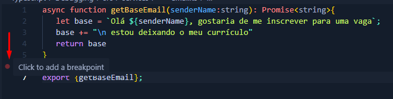
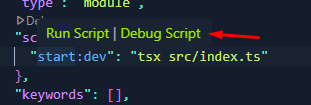
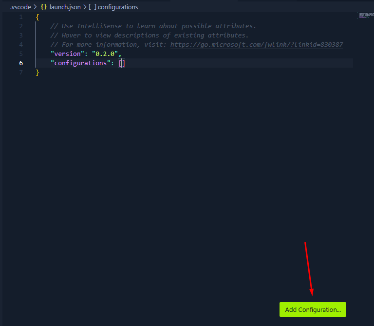
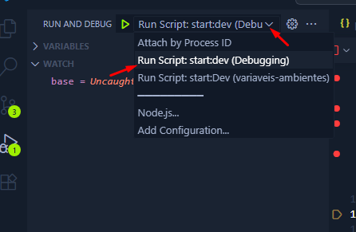

# Debugging/Depuração

Debugging é o processo de identificar, analisar e corrigir erros (bugs). Capturar os erros.

Pode ser feito manualmente (analisando o código) ou com o auxílio de ferramentas chamadas depuradores (debuggers).

Desenvolvedora do Flow-Matic, que serviu como base para o Cobol e criou o termo 'bug'.
[Quem foi Grace Hopper (Biografia de Grace Hooper | História de Grace Hopper)](https://www.youtube.com/watch?v=5VKjvJDbAxI)

## Breakpoint e Javascript Debug Mode

Para depurar precisamos executar o código linha por linha.

Breakpoint é um ponto de parada.



Quando for depurar ele para onde colocamos o breakpoint.

Ir no package.json, passar o mouse no script e clicar em debug script



## Watch Variables

Posso escrever em watch, no debugging, o nome da variável. Conforme dou o step into (⬇) ele acompanha o que está sendo armazenado naquela variável.

## Debug Mode e Lauch Json

Ao clicar em Run and Debug (no inseto com o play, do lado esquerdo do vscode), posso clicar em create a launch.json file para customizar a depuração.

Cria a pasta .vscode onde ficam todas as config do vscode e dentro dela o arquivo launch.json

Ir em Add Configuration


 Escolher o modelo 'Attach to process' do NodeJS

```
{
    "name": "Attach by Process ID",
    "processId": "${command:PickProcess}",
    "request": "attach",
    "skipFiles": [
        "<node_internals>/**"
    ],
    "type": "node"
}
```

Agora escolhemos o script:



Dessa forma, não preciso ir no package.json e clicar em run debug no script. 

Criamos um perfil de debug (customização de como o modo debug deve rodar)

O outro modo abre a ferramenta javascript debug terminal e só funciona para js e ts.

## Anotações

No import não preciso passar a extensão trabalhando com ts.

`import { getBaseEmail } from "./services/email";`

