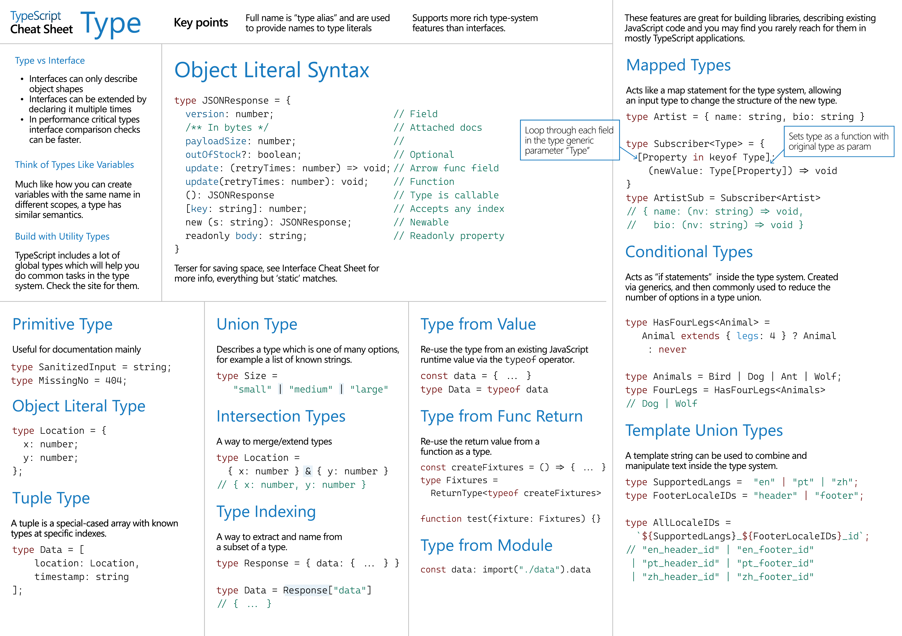

# Typescript

Curso Typescript DIO


## Superset

Em programação, "superset" (subconjunto superior ou superconjunto) é um termo que significa que uma linguagem ou tecnologia inclui tudo que outra tem, e ainda adiciona mais recursos.

TypeScript é um superset de JavaScript

## Dist
Na programação, "dist" geralmente é uma abreviação de "distribution" (distribuição).


dist/ é onde ficam os arquivos finais do seu projeto, prontos para serem distribuídos, hospedados ou executados.

Na dist o projeto vai ser compilado para javascript

## Transpile

Transpilar é transformar código de uma linguagem para outra muito parecida (ex: TS → JS).

Exemplo:
```
// TypeScript (não roda no navegador)
let nome: string = "Andressa";
```

⬇️ Transpilado para JavaScript:

```
// JavaScript (roda no navegador)
let nome = "Andressa";
```
➡️ Ainda é código legível, só mudou de “dialeto”.

Transpile é diferente de compile:

O que é compile?

Compilar normalmente transforma código em algo mais próximo da linguagem de máquina, que o computador entende diretamente (ex: C → binário).

Exemplo com C:

```
// Código C
int soma(int a, int b) {
  return a + b;
}
```

⬇️ Compilado para linguagem de máquina (não legível por humanos):

```
101010 000011 101101 000111 ... (binário)
```

➡️ Vira um arquivo executável (.exe) que o computador entende.

fonte: ChatGPT

## Compile-time x Runtime

Compile-time: identifica o erro em quanto compila, enquanto escreve o código (evidencia erro muito antes) - Typescript

Runtime: identifica o erro só depois que roda/executa o projeto - Javascript

## Como configurar o typescript no projeto

[Configuração do Typescript - readme](./Config-Typescript/readme.md)

## Typescript Cheat Sheets (Folha de cola)

Acesse todas no link: https://www.typescriptlang.org/cheatsheets/




