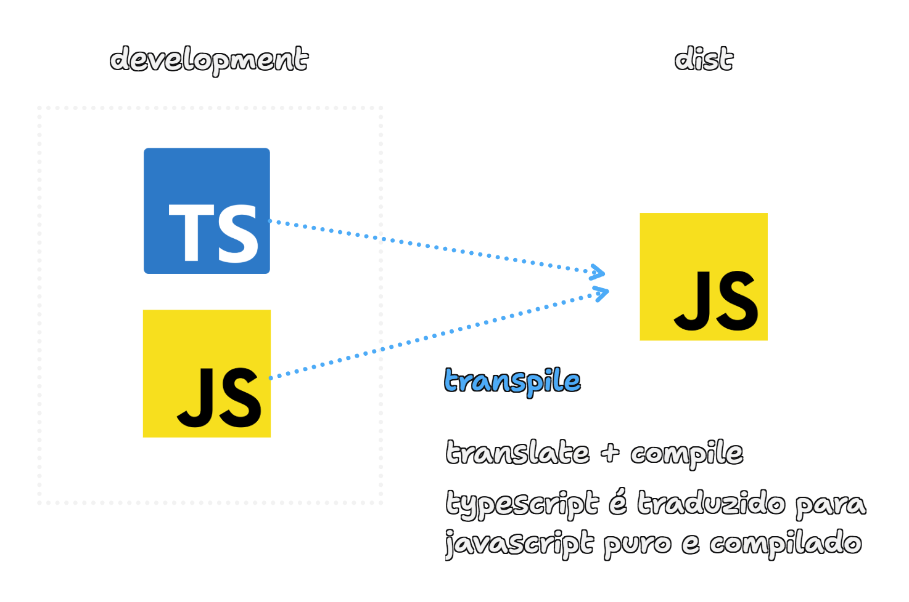

# Typescript

## Superset

Em programação, "superset" (subconjunto superior ou superconjunto) é um termo que significa que uma linguagem ou tecnologia inclui tudo que outra tem, e ainda adiciona mais recursos.

TypeScript é um superset de JavaScript

## Dist
Na programação, "dist" geralmente é uma abreviação de "distribution" (distribuição).

dist/ é onde ficam os arquivos finais do seu projeto, prontos para serem distribuídos, hospedados ou executados.

Na dist o projeto vai ser compilado para javascript

## Transpile

