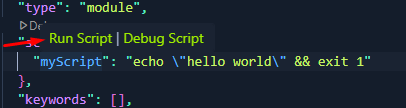
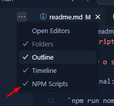
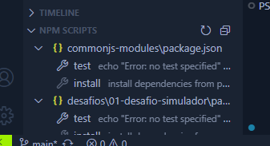
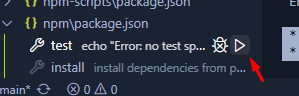

# Npm Scripts

Com scripts consigo rodar mais de um comando uma única vez

## Script Field

No package.json:

```
"scripts": {
"test": "echo \"Error: no test specified\" && exit 1"
},
```

script field:

"scripts": {},

script test:

test é o alias no script, o apelido 

Quando passo o próximo comando uso  &&:

1 comando: "echo \"Error: no test specified\" 
2 comando: exit 1

## Rodar o script

No terminal:

`npm run nome-script`

Exemplo:

`npm run test`

## Vscode View npm scripts

Podemos rodar o script pelo package.json:



Ir no vscode, ao lado de Explores > ... > ativar o npm script



Isso ativa a barra inferior de NPM SCRIPTS 



Dar play para rodar o script


