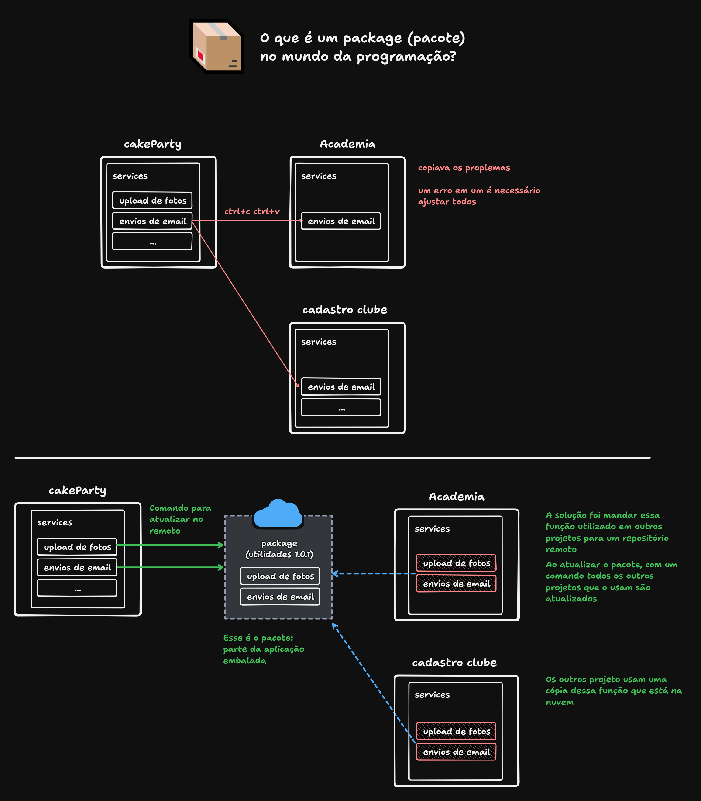
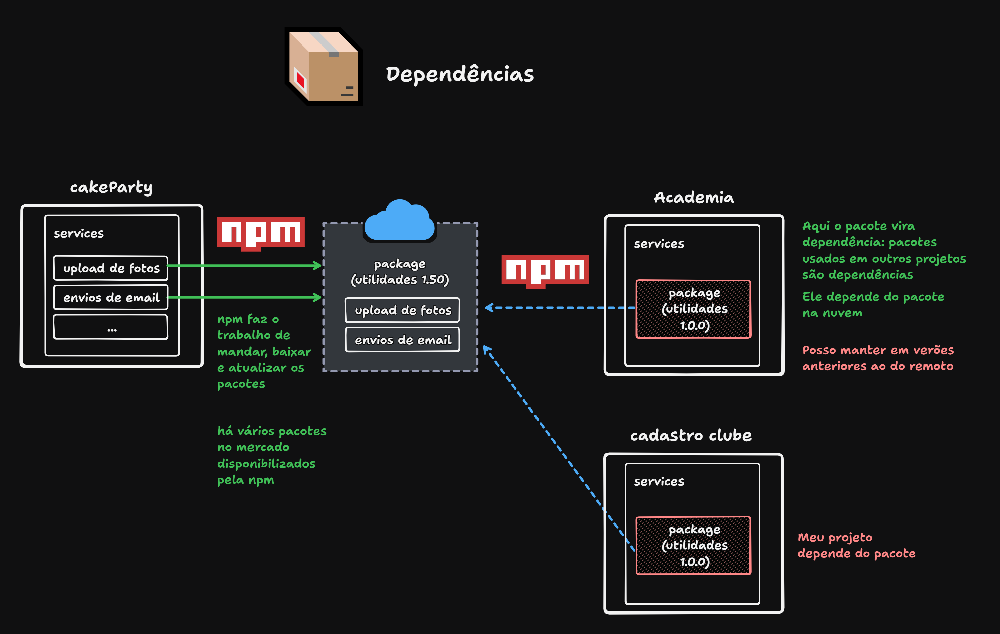
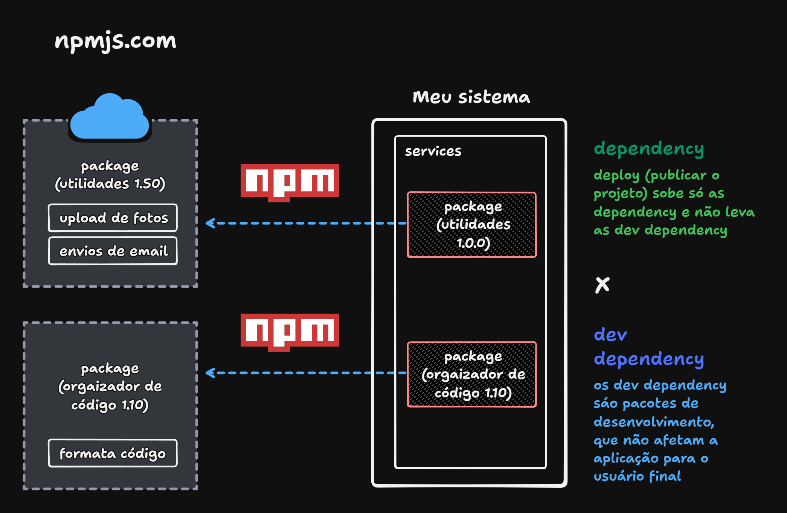

# Npm


npm (node package manager) é o gerenciador de pacote do node

Cada linguagem tem seu repositório com os seus pacotes. 
Todos os pacotes e repositórios ficam disponíveis no site:

https://www.npmjs.com/ 

O nodejs já instala o npm na máquina.
Verificar a versão: `npm --version`
Iniciar o projeto: `npm init -y`

## Package - pacotes
O que é um package (pacote) no mundo da programação?



## Dependencies - dependência



## Dev Dependencies - dependência de desenvolvimento



## Anotações

Yarn é uma alternativa ao npm

75 pacotes de nodejs:

https://firebearstudio.com/blog/node-js-command-line-apps-utilities.html

O node trata todo o projeto dele como um pacote, por isso há o package.json, pra gerenciar o pacote/projeto todo.

## Instalar pacote

Ir no site do npm, buscar o pacote

### Instalar pacote:

Exemplo com chalk:

`npm i chalk`

### Verificar se foi instalado

Ir no package.json

```
"dependencies": {
    "chalk": "^5.4.1" // posso mudar aqui a versão
}
```

### node_modules

Ao instalar um pacote ele cria a paste node_modules, geralmente ela é a pasta mais pesada de um projeto nodejs

O pacote baixado pode ter as dependências de outros pacotes, posso ver no package.json dentro da pasta do pacote chalk

Por ser um arquivo pesado é recomendado não instalar vários pacotes no projeto

### package-lock.json

package-lock.json seria a receita para replicar todas as dependências e sub-dependências do meu projeto e suas versões

não é recomendado mexer nesse arquivo

posso guardar o package-lock.json dentro do package.json (opcional)

`control + shift + p`

digitar settings > Preferences: Open User Settings (JSON)

no settings.json:

```
"explorer.fileNesting.enabled": true,
"explorer.fileNesting.patterns":{
    "ormconfig.json": "ormconfig.sample.json",
    "package.json": "package-lock.json, yarn.lock, pnpm-lock.yaml, bun.lockb, bun.lock"
},
```

### gitignore

Quando mando o projeto pro github eu posso ignorar arquivos, como o node_modules.

Criar arquivo na raiz do projeto: .gitignore

No .gitignore

node_modules/

/(barra) diz que tenho que ignorar tudo que estiver dentro dessa pasta node_modules

### restore

Caso eu clone um repositório le não clona com o node_modules,\
para rodar o projeto preciso digitar no terminal 

`npm i`

Assim instala todas as dependências necessárias informadas no package-lock.json

### usage

Para usar ver na documentação do pacote no site da npm.
Geralmente usamos com import.

### usage dev dependencies

Usar o -D no comando de instalação do pacote:

`npm i log-symbols -D`

No package.json fica em dev dependencies:

```
"devDependencies": {
    "log-symbols": "^7.0.1"
}
```

Usar:

import apelido from "nome-exato-do-pacote";

`import logSymbols  from "log-symbols"`

As dev dependencies não rodar no servidos, no ambiente real. Elá só serve na hora do desenvolvimento.
