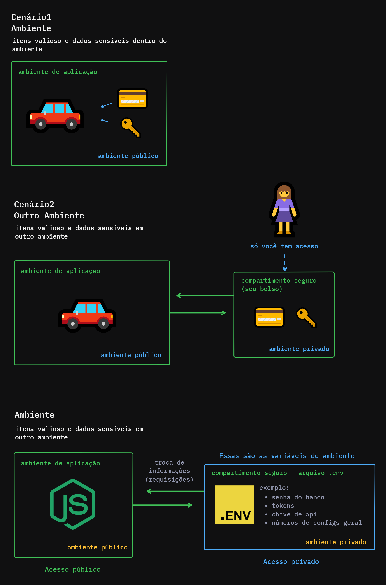

# Gerenciando Variáveis de Ambientes com NPM



## Dotenv File

Env = Environment (Ambiente)

Na raiz do projeto cria um arquivo .env

Para deixar em um ambiente privado, ele não pode ser versionado junto com a aplicação.

Colocamos esse arquivo no .gitignore 

No arquivo .gitignore (criamos ele na raiz do projeto):

```
node_modules/
.env
```

## Environment Variables

Declarar variáveis de ambiente: 

São formadas por chave -> valor
Geralmente as chaves são em maiúsculo.

No arquivo .env:

USERDATABASE="Cruso"
PASSWORDDATABASE="DIO"

## Process.Env

Como conectar o arquivo .env com a aplicação.

Ir no package.json:

Adicionar a flag  --env

```
"scripts": {
    "start:Dev": "node --env-file=.env --watch src/index.js"
},
```

Para acessar as variáveis do .env no projeto (index.js):

console.log(process.env.USERDATABASE);

## Multiple Dotenv

Geralmente, nos projetos, podem existir mais de um arquivo .env. 

* .env.prod = env de produção, aponta para o banco de dados verdadeiro (tech lead/lideres que tem acesso a esse env)
* .env.development = env de desenvolvimento, aponta para o banco de testes

Altera o nome do arquivo no package.json:

```
"scripts": {
    "start:Dev": "node --env-file=.env.development --watch src/index.js"
},
```

## dotenv x package

Antigamente o .env não era nativo no nodejs, era usado um pacote npm.

Versões do node inferiores à versão 20 não tem suporte aos arquivos .env.

Caso trabalhe com versões do node sem o suporte:

Pesquise o pacote dotenv no site npm: https://www.npmjs.com/package/dotenv

Instala o pacote, importa no arquivo js

Usa da mesma maneira: cria o .env e usa o process.env no arquivo

